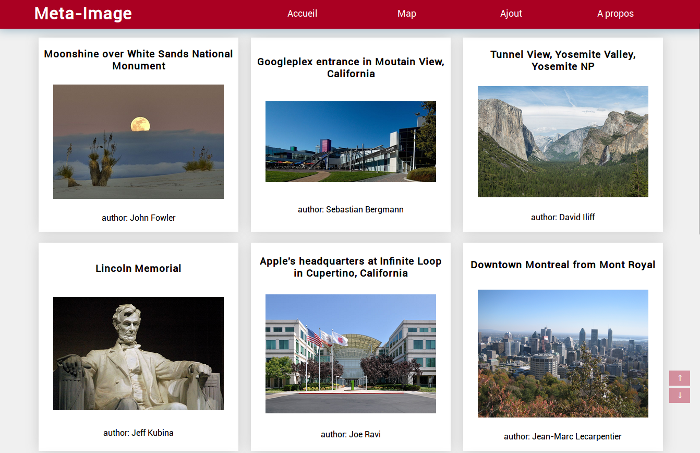
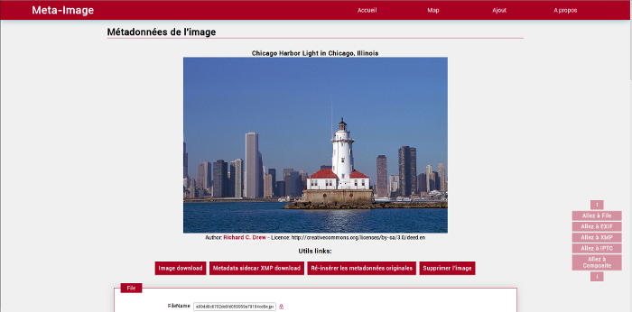

# silex-exiftools
Our silex-exiftools project is a group project involving [`Evrard Carron`](https://github.com/Five52/), [`Thomas Fortin`](https://github.com/ThomasFortin/) and [`Pierre Labadille`](https://github.com/plabadille/), students in M2-DNR2i from the University of Caen.
The goal of this project is to create a web gallery supporting metadata editing. It also have some improvements like module google maps which locate every picture in a map or Flickr module which let the user to search on Flickr similar pictures.

This project was proposed by Jean-Marc Lecarpentier, teacher from the University of Caen.

## Screens

### Home:



### Image detail:



## Dependencies

* [`Composer`](https://getcomposer.org/) 
* [`Exiftool`](http://www.sno.phy.queensu.ca/~phil/exiftool/) 

## Installing

Make sure you install the depencies (exiftool has to be installed and accessible by our app in your server).

Clone the repository
```
git clone https://github.com/Five52/silex-exiftools
cd silex-exiftools
composer install
```

Update the constants URI and IMG_ABSOLUTE_PATH in "/src/Image.php" with your absolute url path (needed to generate correct twitter cards and facebook graph).

## Built with

* [`Silex`](http://silex.sensiolabs.org/)
* [`Exiftool`](http://www.sno.phy.queensu.ca/~phil/exiftool/)
* [`Twig`](http://twig.sensiolabs.org/)


## License

This project is licensed under the GNU License - see the [LICENCE](LICENSE) file for details
